# S-Project 5: Pharmacy Claims Data — 3NF Normalization, Star Schema, ERD & Analytics (SQL + Data Warehousing)

This project transforms a raw pharmacy claims dataset into a **fully normalized 3NF schema**, creates a clean **star schema**, establishes **PK/FK constraints in MySQL**, and performs analytic reporting on prescription patterns.

* **Dataset:** Pharmacy Claims Data  
* **Tools:** SQL, MySQL Workbench, Data Warehousing  
* **Techniques:** 1NF → 3NF normalization, fact/dimension modeling, star schema creation, primary/foreign keys, referential integrity, analytic reporting  
* **Goal:** Convert messy prescription-fill data into a robust analytical data model.

---

# 🧱 1. Normalization to 3NF  

### 🔧 Issues in the Original Dataset
The raw dataset violated **1NF, 2NF, and 3NF**, including:

- 🔁 Columns like `fill_date1`, `fill_date2`, `fill_date3` storing repeated values horizontally  
- 🔁 Member demographic attributes repeated across multiple rows  
- 🔁 Drug attributes repeated for each NDC  
- 🔁 Derived fields (e.g., `member_age`) stored redundantly  
- 🔁 Multiple transitive dependencies  

### ✔ Normalization Strategy
To achieve **Third Normal Form (3NF)**:

- **Unpivot** all fill_date columns → each prescription fill becomes its own row  
- **Separate member data** into a dimension table  
- **Separate drug information** into a dimension table  
- **Create a fact table** containing one record per prescription fill  
- **Remove derived columns** (e.g., age) to eliminate redundancy  

---

# 🗂️ 2. Final 3NF Tables

### 📌 **Dimension Table — dim_member**

  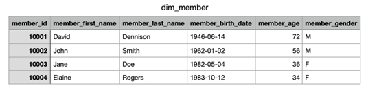

| Column              | Description                         |
|---------------------|-------------------------------------|
| member_id (PK)      | Unique member identifier            |
| member_first_name   | First name                          |
| member_last_name    | Last name                           |
| member_birth_date   | Used to derive age dynamically      |
| member_gender       | Gender                              |

---

### 📌 **Dimension Table — dim_drug**

  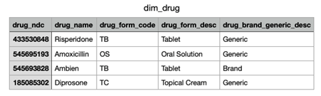

| Column              | Description                         |
|---------------------|-------------------------------------|
| drug_ndc (PK)       | National Drug Code (unique key)     |
| drug_name           | Drug name                           |
| drug_form_desc      | Dosage form description             |
| therapeutic_class   | Drug classification group           |

---

### ⭐ **Fact Table — fact_claim**

  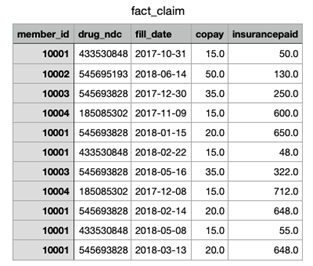

| Column                   | Role       | Description                                |
|--------------------------|------------|--------------------------------------------|
| claim_id (PK)            | Surrogate  | Unique claim record                        |
| member_id (FK)           | Natural    | References `dim_member.member_id`          |
| drug_ndc (FK)            | Natural    | References `dim_drug.drug_ndc`             |
| fill_date                | Date       | Date of prescription fill                  |
| copay                    | Fact       | Member copay                               |
| insurancepaid            | Fact       | Amount paid by insurance                   |

### ✔ Fact Type Classification
- **copay** → additive  
- **insurancepaid** → additive  
Both can be aggregated across time, member, and drug.

### ✔ Grain of the Fact Table
**One row = one prescription fill for one drug by one member on one date.**

---

# 🗄️ 3. Primary & Foreign Keys (MySQL)

### 🔑 Primary Keys

| Table        | Primary Key  | Type        |
|--------------|--------------|-------------|
| dim_member   | member_id    | Natural     |
| dim_drug     | drug_ndc     | Natural     |
| fact_claim   | claim_id     | Surrogate   |

### 🔗 Foreign Keys (fact_claim)

| Foreign Key | References                | Reason |
|-------------|---------------------------|--------|
| member_id   | dim_member.member_id      | Links claim → member |
| drug_ndc    | dim_drug.drug_ndc         | Links claim → drug   |

### ⚙ Referential Integrity Rules
- **ON DELETE RESTRICT** → prevents deleting a member/drug with existing claims  
- **ON UPDATE CASCADE** → updates propagate to fact table automatically  

This ensures:
- no orphaned claims  
- clean, consistent data across fact/dimension tables  

---

# ⭐ 4. Star Schema (MySQL Workbench)

1.Create a new database.

  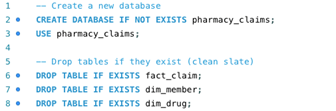

### ⭐ FACT TABLE  
2.Create a `fact_claim` table.

  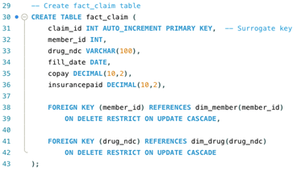

### ⭐ DIMENSIONS  
3.Create a `dim_member` table.  

  

4.Create a `dim_drug` table.

  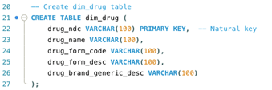

---

# 🧭 5. ERD (Entity Relationship Diagram)

Your ERD was built by placing the fact table at the center and linking both dimension tables.

  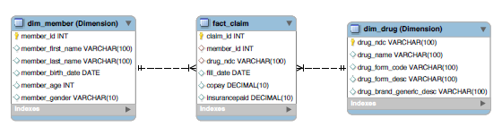
  
<em>Final ERD for pharmacy claims star schema.</em>

---

# 📊 6. Analytics & Reporting

### 📌 1. Number of Prescriptions by Drug Name  
- **Ambien** was filled **5 times**.

  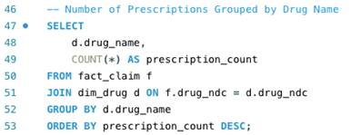

  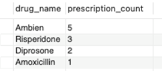

---

### 📌 2. Summary by Age Group (≥65 vs <65)  
- Only **1 member** is aged 65+.  
- That member filled **6 prescriptions**.

  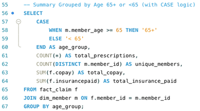

  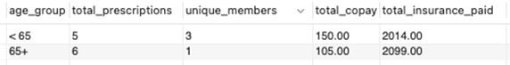

---

### 📌 3. Most Recent Fill + Insurance Paid (Window Function)  
- Member **10003**  
- Most recent drug: **Ambien**  
- Insurance paid: **$322.00**

  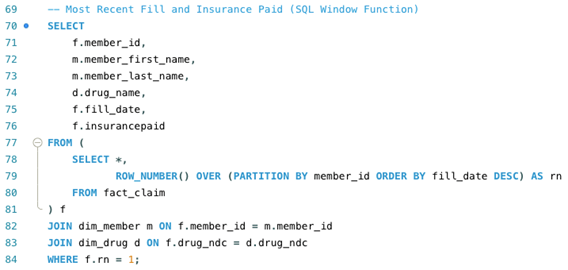

  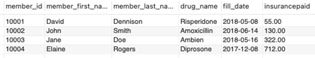

---

# 🧠 Skills Demonstrated

- Normalization (1NF → 2NF → 3NF)  
- Identifying fact vs. dimension attributes  
- Designing a star schema from a raw dataset  
- Creating surrogate and natural keys  
- Enforcing referential integrity (RESTRICT, CASCADE)  
- ERD modeling in MySQL Workbench  
- Analytical SQL with grouping + window functions  
- Storytelling with healthcare-related data  

